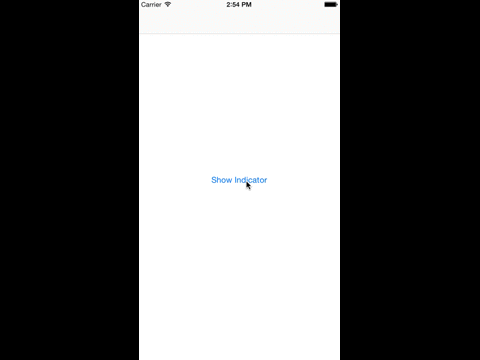

# loading-indicator
<p align="center">


[](https://developer.apple.com/iphone/index.action)
[](https://developer.apple.com)
[](https://github.com/dErangaPrasad/loading-indicator/issues?state=open)

Features
-----

Installation
-----
``` objc
//Just add LoadingIndicator.h and LoadingIndicator.m to your project

//Initialize the indicator in viewDidLoad
- (void)viewDidLoad {
    [super viewDidLoad];
    self.indicator = [[LoadingIndicator alloc] initWithDelegate:self];
    self.indicator.loadingText = @"Loading";
}

//Show indicator
[self.indicator show];

//Hide indicator
[self.indicator hide];
```

Requirements
-----
- iOS 6.0+
- Xcode 5.0

License
-----
